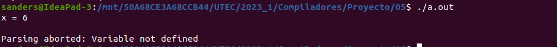

# Simple-C compiler

## Integrantes

- Sanders Chancan Chanca
- Brayan Eduardo Gomero Castillo
- Neo Marcelo Zapata Gallegos

## Introducción

Proyecto final del curso: **Compiladores (CS3025)**

El presente proyecto consiste en una implementación de un compilador para el lenguaje _Simple-C_ el cuál es descrito [aquí](./Proyecto.pdf) por el docente _Yarasca Moscol, Julio Eduardo_

### Partes implementadas

- [x] Analizador léxico (Lexer)
- [x] Analizador sintáctico (Yacc)
- [x] Analizador semántico
- [x] Generación de Código intermedio (Código en tres direcciones)

### Instalación

Descargar el contenido del repositorio en una carpeta.

#### Requisitos

Necesitamos las siguientes herramientas:

- flex 2.6.4
- bison (GNU Bison) 3.8.2
- gcc 11.3.0

#### Pasos para compilar el compilador

En la carpeta donde descargó el código, ejecutar los siguientes comandos **en orden** en tu terminal:

```
lex scanner.l
yacc parser.y -d
gcc main.c -ll
```

**Nota:** Existen 3 diferentes archivos _entrada.txt_ asegúrate de correr el que deseas modificando el archivo **main.c**. ¡También puedes probar tu propio código escrito en _Simple-c_!

## Fundamento teórico

El fundamento teórico principal de este proyecto se basó en las clases del curso de **Compiladores (CS3025)** y del libro **Compilers Principles Techniques And Tools**.

### Análisis Léxico

Tal como señala el libro **Compilers Principles Techniques And Tools**: "El análisis léxico propiamente dicho es la parte más compleja, donde el escáner produce la secuencia de tokens como salida" (Alfred Aho et al, 2011, p.133). En nuestro proyecto el análisis léxico es realizado mediante flex, en donde se definen mediante gramáticas regulares los token que desamos obtener dentro de una entrada dada.

### Análisis Sintáctico

Se sabe que "El analizador utiliza los primeros componentes de los tokens producidos por el analizador léxico para crear una representación intermedia en forma de árbol que representa la estructura gramatical del flujo de tokens." (Alfred Aho et al, 2011, p.31). En nuestro proyecto esta parte fue trabajada con yacc y para ello se estableció una gramática en donde se verifica que no exista ambiguedad que yacc no pueda manejar.

### Análisis semántico y Generación de Código intermedio

En esta parte incluimos la generación de código intermedio. El cuál "consiste en una secuencia de instrucciones tipo ensamblador con tres operandos por instrucción." (Alfred Aho et al, 2011, p.32).

### djb2 hash

Este algoritmo fue utilizado para crear un código hash para cadenas de carácteres, que en nuestro caso consistirían en las variables declaradas en simple-c, que luego se procederan a buscar si se utilizan posteriormente. El código del hash y del algoritmo fue adaptado a partir de la siguiente página: https://medium.com/swlh/hash-tables-in-c-with-the-djb2-algorithm-21f14ba7ca88

## Métodos y Desarrollo

### Scanner.l

Para el análisis léxico nos guiamos de los tokens dejados en la descripción del proyecto. Entre ellos encontramos:

- Delimitadores: (), {}
- Operadores aritméticos: +, −, /, ∗, %
- Operadores de relación: <, >, <=, >=, ==, ! =
- Operadores lógicos: ||, &&
- Operador de asignación: :=
- Identificadores: secuencias de carácteres, dígitos que comienzan por una letra.
- Palabras reservadas: main, if, while, else, putw, puts, int

Además agregamos:

- Comentarios: Son de la forma /\* algo \*/
- Strings que pueden estar definidos por: "string" o 'string'

Todos estos fueron definidos usando expresiones regulares y se encuentran en el archivo [scanner.l](./scanner.l)

### Parser.y

#### Structuras

Fue el archivo más complicado de implemetar. Para ayudarnos en nuestro análisis sintáctico y semántico dentro de este archivo definimos las siguientes structuras:

- TempLabel: Estructura que genera objetos que pueden ser usados como temporales o labels en el código de tres direcciones

- Nodo: Nodo usado para la creación de una pila dinámica que almacena estructuras del tipo **TempLabel**

- Pila: Pila que almacena objetos del tipo **TempLabel** insertados dentro de una estructura Nodo

- Node: Nodo para la estructura Hash. La cual almacena variables que serán usadas en el código en tres direcciones.

- HashTable: Estructura que almacena variables que serán usadas en el código en tres direcciones. Como las variables son cadena de carácteres, se utiliza el algoritmo **djb2** para generar su valor único dentro del hash.

- Pila(Array): Actua como pila principal del programa para generar el código en tres direcciones.

#### Declaraciones de estructuras

Se declaran las estructuras de la siguiente manera:

```
struct TempLabel temporal= {'t', 0};
char pila[100][10];
int top=0;

struct Pila pila_label;
struct TempLabel label= {'L', 0};

struct Pila pila_while;
struct TempLabel label_while= {'W', 0};

struct Pila pila_if;
struct TempLabel label_if= {'I', 0};

HashTable hash_table;
```

#### Funciones

Para hacer uso adecuado de las estructuras se crearon fucniones que ejecutaran diversos métodos de las estructuras de acuerdo al desarrollo del análisis semántico-

- push_pila: Inserta elementos yytext que se van reuniendo por medio del análisis semántico a la estructura pila que luego se usarán para la generación de código en tres direcciones.

- push_label: Inserta un label en la pila creada para los label y aumenta su contador en 1.

- push_label_while: Inserta un label en la pila creada para los while y aumenta su contador en 1.

- push_label_if: Inserta un label en la pila creada para los if y aumenta su contador en 1.

- codegen: Genera el código intermedio utilizando elementos de la pila principal

- print_label: Desapila la pila de los label y lo imprime.

- print_label_while: Desapila la pila de los label para los while y lo imprime.

- print_label_if: Desapila la pila de los label para los if y lo imprime.

- Wincond: Imprime el salto incondicional del while desapilando la pila de los while

- Iincond: Imprime el salto incondicional del if-else tomando el primer la pila de los if

- Lcond: Lógica del if. Primero negar la expresión que se evaluará y imprimir un salto condiciona si se cumple esa expresión negada.

- search_hash: Busca la variable obtenida mediante yytext y la busca en el hash. Si la encuentra se ejecuta de manera normal el programa; sino se para y arroja el siguiente error: "Parsing aborted: Variable not defined"

- insert_hash(): Inserta el valor obtenido por yytext al hash

#### Gramática

Gramática para el lenguaje _Simple-C_:

- S => M
- S => D M

- D => INT identifier_list FINAL_LINEA

- identifier_list => IDENTIFICADOR
- identifier_list => identifier_list COMA IDENTIFICADOR

- M => MAIN PARENTESIS_A PARENTESIS_C LLAVE_A C LLAVE_C

- I => IF PARENTESIS_A B PARENTESIS_C if_block

- if_block => LLAVE_A C LLAVE_C
- if_block => LLAVE_A C LLAVE_C ELSE LLAVE_A C LLAVE_C

- W => WHILE PARENTESIS_A B PARENTESIS_C LLAVE_A C LLAVE_C

- C => A FINAL_LINEA C
- C => PUTS PARENTESIS_A CONST_CADENA PARENTESIS_C FINAL_LINEA C
- C => PUTW PARENTESIS_A E PARENTESIS_C FINAL_LINEA C
- C => I C
- C => W C
- C => e

- B => E MENOR E
- B => E MAYOR E
- B => E MENOR_IGUAL E
- B => E MAYOR_IGUAL E
- B => E IGUALDAD E
- B => E DESIGUALDAD E

- A => V ASIGNACION E

- E => E SUMA E
- E => E RESTA E
- E => E MULTIPLICACION E
- E => E DIVISION E
- E => E DIVISION_ENTERA E
- E => PARENTESIS_A E PARENTESIS_C
- E => V
- E => NUMERO

### Mejoras en Desarrollo

#### If y while anidados

Como veremos en los **resultados** el código en _simple-c_ del archivo _entrada.txt_ nuestro compilador acepta **if** anidados, de la misma forma que **while's** anidados. En ese sentido la salida de nuestro código ha sido validada mediante un análisis manual a las entradas utilizadas.

#### Declaración de variables

Como veremos en los **resultados** el código en _simple-c_ del archivo **entrada_con_errores.txt** muestra que el compilador reconoce cuando una variable no ha sido declarada, pero ha sido usada en la ejecución del programa. Esto se logró mediante una implementación de un **hash** que almacena las variables que van siendo declaradas antes de la función **main** tal como es especificado en la descripción del proyecto.

## Resultados

Básicamente se probaron 3 programas escritos en los archivos: entrada.txt, entrada2.txt y entrada3.txt. Y se obtuvo el siguiente código intermedio.

### Entrada.txt

#### Código Simple-c


#### Código en tres direcciones


### Entrada2.txt

#### Código Simple-c


#### Código en tres direcciones


### Entrada3.txt

#### Código Simple-c


#### Código en tres direcciones


### Entrada con errores

Adicionalmente se creó un input que basada en la **entrada2.txt** incluye un error. Este error se basa en que la varible y no fue definida. Aquí se muestran los resultados

#### Código Simple-c


#### Código en tres direcciones



## Conclusiones

En conclusión, el proyecto de desarrollar un compilador para el lenguaje Simple-C utilizando las herramientas Lex y Yacc ha sido un proceso desafiante pero gratificante. A lo largo de este proyecto, se ha logrado diseñar e implementar un sistema capaz de analizar y procesar programas escritos en Simple-C, generando código en tres direcciones a partir de ello.

Durante el desarrollo del compilador, se ha trabajado en varias etapas fundamentales, como el análisis léxico, el análisis sintáctico y la generación de código. Se ha utilizado Lex para definir los patrones de los tokens en el lenguaje Simple-C y generar el analizador léxico correspondiente. Por otro lado, Yacc ha sido utilizado para especificar la gramática del lenguaje y construir el analizador sintáctico.

Una vez completadas estas etapas, se ha logrado traducir programas escritos en Simple-C a un código de tres direcciones, que luego puede ser utilizado por un intérprete o compilador de más bajo nivel para generar código ejecutable para una plataforma específica.

Este proyecto ha proporcionado una comprensión profunda de los conceptos fundamentales de la compilación y ha permitido aplicar esos conocimientos en la práctica. Se ha experimentado con el diseño de gramáticas, el manejo de expresiones regulares y la generación de código intermedio. Además, se ha adquirido experiencia en el uso de herramientas poderosas como Lex y Yacc, que simplifican significativamente el proceso de desarrollo de un compilador.

## Bibliografía

- Alfred Aho et al. (2011) Compilers Principles Techniques And Tools. 2nd. ISBN:10-970-26-1133-4. Pearson.
- Vo, T. (2021, December 10). Hash Tables in C++ with the djb2 Algorithm - The Startup - Medium. Medium. https://medium.com/swlh/hash-tables-in-c-with-the-djb2-algorithm-21f14ba7ca88
